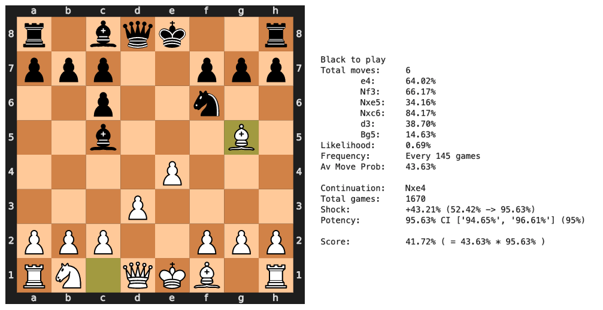

<!-- PROJECT SHIELDS -->
[![Contributors][contributors-shield]][contributors-url]
[![Forks][forks-shield]][forks-url]
[![Stargazers][stars-shield]][stars-url]
[![Issues][issues-shield]][issues-url]
[![MIT License][license-shield]][license-url]
[![LinkedIn][linkedin-shield]][linkedin-url]

<!-- PROJECT LOGO -->
<br />
<p align="center">
  <a href="https://github.com/davidADSP/chess-trap-scorer">
    
  </a>

  <p align="center">
    Chess Trap Scorer
    <!-- <br /> -->
    <!-- <a href="https://github.com/davidADSP/chess-trap-scorer"><strong>Explore the docs »</strong></a> -->
    <br />
    <!-- <a href="https://github.com/davidADSP/chess-trap-scorer">View Demo</a> -->
    ·
    <a href="https://github.com/davidADSP/chess-trap-scorer/issues">Report Bug</a>
    ·
    <a href="https://github.com/davidADSP/chess-trap-scorer/issues">Request Feature</a>
  </p>
</p>
<br>


<!-- TABLE OF CONTENTS -->

<summary><h2 style="display: inline-block">Table of Contents</h2></summary>
<ol>
  <li>
    <a href="#about-the-project">About The Project</a>
  </li>
  <li>
    <a href="#getting-started">Getting Started</a>
  </li>
  <li><a href="#license">License</a></li>
  <li><a href="#contact">Contact</a></li>
  <li><a href="#acknowledgements">Acknowledgements</a></li>
</ol>


<br>

---
<!-- ABOUT THE PROJECT -->
## About The Project



This project allows you to score trappy chess openings, based on two factors:

🎲  <b>Probability</b>

How likely is the player to play the next move in the trap sequence?

A good trap should have a high likelihood that the next move in sequence is commonly chosen.

😵  <b>Potency</b>

How likely is the player to lose after they have fallen into the trap?

A good trap should be deadly once your opponent has fallen into it!

---

🎯 <b>Trap score</b>

The trap score for a given pgn input is the product of these two scores.

For more information, see the accompanying [blog post](https://medium.com/applied-data-science/how-to-train-ai-agents-to-play-multiplayer-games-using-self-play-deep-reinforcement-learning-247d0b440717).

Have fun!

---
<!-- GETTING STARTED -->

## Getting Started

To get a local copy up and running, follow these simple steps.


<!-- INSTALLATION -->
### Installation

1. Clone the repo
   ```sh
   git clone https://github.com/davidADSP/chess-trap-scorer.git
   cd chess-trap-scorer
   ```
2. Pip install requirements (inside a virtual environment)
   ```sh
   pip install -r requirements.txt
   ```

<!-- QUICKSTART -->
### Quickstart

To score a given opening, simply use the following command, with the pgn of your choice.

   ```sh
   python3 scorer.py --pgn '1. e4 e5 2. Nf3 Nf6 3. Nxe5 Nc6 4. Nxc6 dxc6 5. d3 Bc5 6. Bg5'
   ```

The [lichess opening API](https://lichess.org/api) is used to gather data for the analysis. No token is required.

The `config.py` file allows you to change the variant, speeds and rating range of the analysis, as well as the number of moves to search over to find the best follow up move and the alpha of the potency confidence interval.


### Output

The output is the following summary (shown here with descriptive labels):

```
Black to play <- The colour of the player who will take advantage of the trap
Total moves:	 6 <- Number of moves played by the opponent
	e4:	        64.02% <- The likelihood that the opponent plays this required move
	Nf3:	    66.17%
	Nxe5:	    34.16%
	Nxc6:	    84.17%
	d3:	        38.70%
	Bg5:	    14.63%
Likelihood:	    0.69% <- The product of the likelihoods
Frequency:	    Every 145 games <- 1 / likelihood
Av Move Prob:   43.63% <- Geometric mean of the move probabilities

Continuation:	Nxe4 <- Best move that takes advantage of the trap
Total games:	1670 <- Number of lichess games where this move has been played
Shock:		    +43.21% (52.42% -> 95.63%) <- The delta of the win likelihood before and after this move
Potency:	    95.63% CI ['94.65%', '96.61%'] (95%) <- The % chance of winning after this move with confdience interval

Trap Score:		    41.72% ( = 43.63% * 95.63% ) <- the product of the Av Move Prob and Potency
```

The higher the trap score, the better the trap!

### Jupyter notebook

A jupyter notebook `traps.ipynb` is also provided, where a view of the board is also rendered.

---
<!-- LICENSE -->
## License

Distributed under the MIT License. See `LICENSE` for more information.

---
<!-- CONTACT -->
## Contact

David Foster - [@davidADSP](https://twitter.com/davidADSP) - david@adsp.ai

Project Link: [https://github.com/davidADSP/chess-trap-scorer](https://github.com/davidADSP/chess-trap-scorer)


---
<!-- ACKNOWLEDGEMENTS -->
## Acknowledgements

Thanks to all the great chess content creators out there - here's three of the best:

* [GothamChess](https://www.youtube.com/channel/UCQHX6ViZmPsWiYSFAyS0a3Q)
* [Agadmator](https://www.youtube.com/c/AGADMATOR)
* [Eric Rosen](https://www.youtube.com/user/RosenChess)

---
<!-- MARKDOWN LINKS & IMAGES -->
<!-- https://www.markdownguide.org/basic-syntax/#reference-style-links -->
[contributors-shield]: https://img.shields.io/github/contributors/davidADSP/chess-trap-scorer.svg?style=for-the-badge
[contributors-url]: https://github.com/davidADSP/chess-trap-scorer/graphs/contributors
[forks-shield]: https://img.shields.io/github/forks/davidADSP/chess-trap-scorer.svg?style=for-the-badge
[forks-url]: https://github.com/davidADSP/chess-trap-scorer/network/members
[stars-shield]: https://img.shields.io/github/stars/davidADSP/chess-trap-scorer.svg?style=for-the-badge
[stars-url]: https://github.com/davidADSP/chess-trap-scorer/stargazers
[issues-shield]: https://img.shields.io/github/issues/davidADSP/chess-trap-scorer.svg?style=for-the-badge
[issues-url]: https://github.com/davidADSP/chess-trap-scorer/issues
[license-shield]: https://img.shields.io/github/license/davidADSP/chess-trap-scorer.svg?style=for-the-badge
[license-url]: https://github.com/davidADSP/chess-trap-scorer/blob/main/LICENSE
[linkedin-shield]: https://img.shields.io/badge/-LinkedIn-black.svg?style=for-the-badge&logo=linkedin&colorB=555
[linkedin-url]: https://linkedin.com/in/davidtfoster
